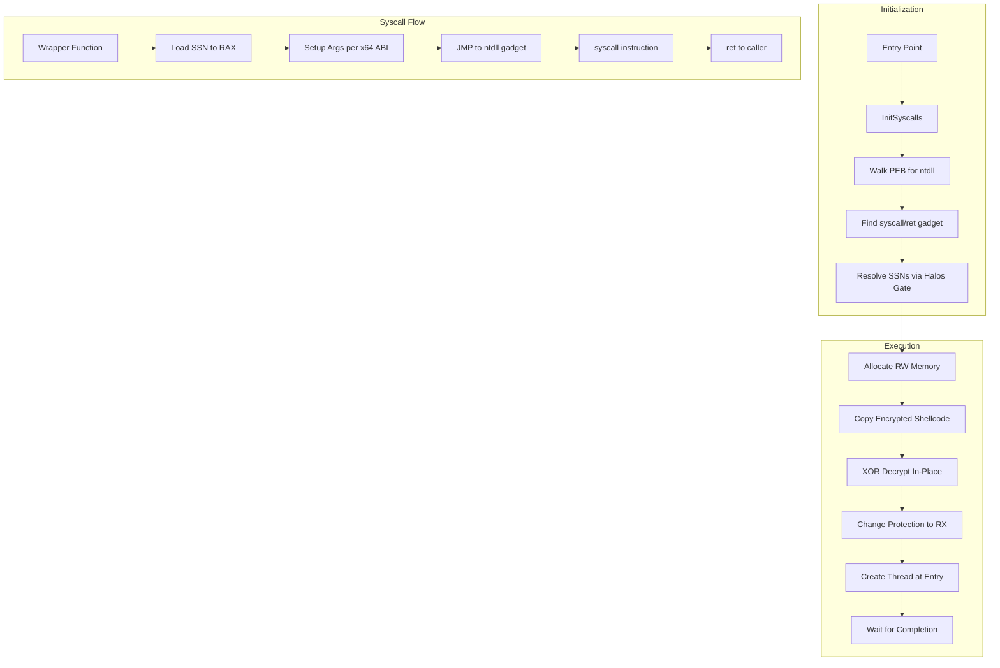
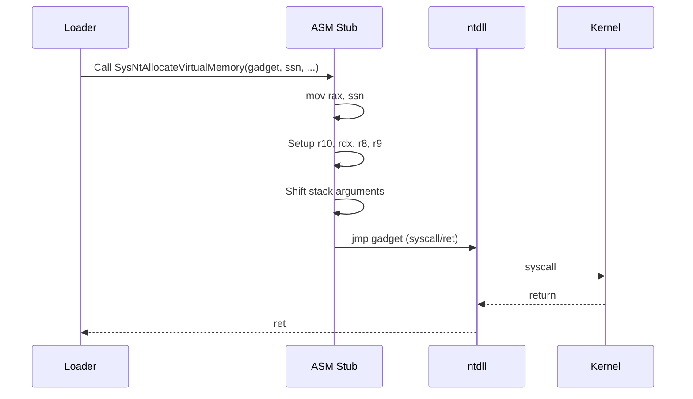
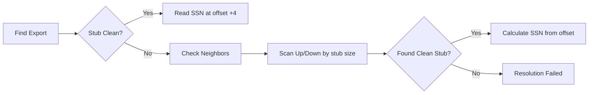

# Shellcode Loader

A position-independent shellcode loader for Windows x64 using indirect syscalls.

## Overview

This loader executes shellcode using indirect syscalls to avoid userland API hooks. It implements Halo's Gate for dynamic syscall number resolution and uses gadget-based execution to appear as legitimate ntdll activity in call stacks.

## Features

- **Indirect Syscalls**: Jumps to `syscall; ret` gadgets in ntdll.dll
- **Dynamic SSN Resolution**: Halo's Gate with neighbor scanning for hooked stubs
- **XOR Encryption**: Rolling XOR with 32-bit key
- **Anti-Analysis**: Optional debugger detection and timing checks
- **Module Stomping**: Optional legitimate DLL hollowing
- **PPID Spoofing**: Optional parent process masquerading

## Architecture



## Indirect Syscall Mechanism



## SSN Resolution (Halos Gate)



## Build Requirements

- Visual Studio 2019/2022 with C++ workload
- Windows SDK
- Python 3.x (for shellcode embedding)

## Build Instructions

1. Generate shellcode (Cobalt Strike, msfvenom, Donut, etc.)
2. Embed shellcode:
   ```
   python embed.py -i payload.bin -o shellcode.h -k 0xDEADBEEF
   ```
3. Build from VS x64 Native Tools Command Prompt:
   ```
   build.bat
   ```

## Project Structure

```
loader.cpp       # Main loader logic
syscalls.asm     # Indirect syscall stubs
syscalls.h       # Syscall declarations
ntstructs.h      # NT structure definitions
obfuscation.h    # String hashing, XOR routines
embed.py         # Shellcode embedder with encryption
build.bat        # Build script
README.md
```

## Configuration

Edit defines in `loader.cpp`:

| Option | Description |
|--------|-------------|
| `CFG_UNHOOK` | Unhook ntdll via fresh copy |
| `CFG_ANTIDEBUG` | Enable anti-debugging checks |
| `CFG_DELAY` | Add execution delays |
| `CFG_SPOOF` | PPID spoofing |
| `CFG_STOMP` | Module stomping |
| `CFG_DEBUG` | Debug logging (disable for production) |

## Syscalls Implemented

| Syscall | Purpose |
|---------|---------|
| NtAllocateVirtualMemory | Memory allocation |
| NtProtectVirtualMemory | Memory protection changes |
| NtFreeVirtualMemory | Memory deallocation |
| NtCreateThreadEx | Thread creation |
| NtWaitForSingleObject | Synchronization |
| NtClose | Handle cleanup |
| NtQueryInformationProcess | Process info |
| NtReadVirtualMemory | Memory read |
| NtDelayExecution | Sleep |
| NtOpenProcessToken | Token access |
| NtTerminateProcess | Process termination |

## Detection Considerations

- Call stack shows return address in ntdll (gadget location)
- ETW kernel telemetry still captures syscall activity
- Memory allocation patterns may be flagged by heuristics
- Encrypted shellcode has higher entropy

## Usage Notes

This tool is intended for authorized security testing, red team operations, and security research. Ensure you have explicit authorization before use.

## License

For authorized security testing only.
